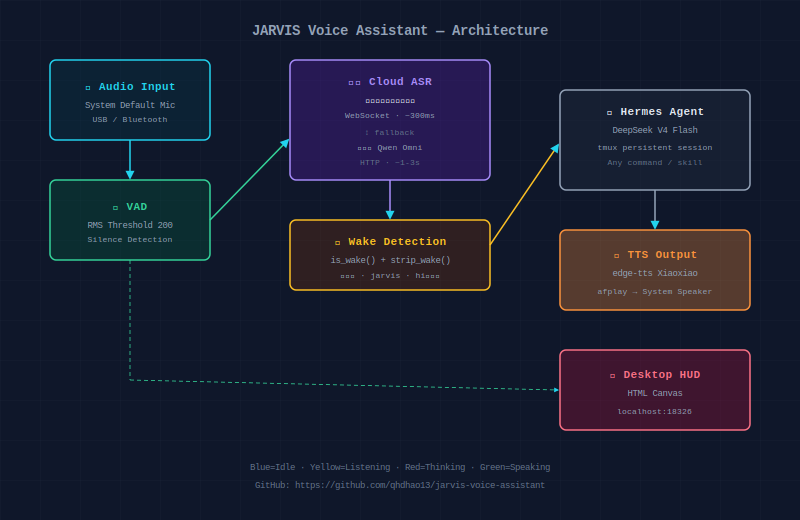

<p align="center">
  
</p>

<h1 align="center">🎙️ Jarvis Voice Assistant</h1>
<h3 align="center">贾维斯语音助手 — Wake-word voice assistant for macOS</h3>

<p align="center">
  <a href="https://github.com/qhdhao13/jarvis-voice-assistant/blob/main/LICENSE"></a>
  <a href="https://www.python.org/"></a>
  <a href="https://www.apple.com/macos/"></a>
  <a href="https://www.volcengine.com/docs/6561/1354869"></a>
  <a href="https://github.com/qhdhao13/jarvis-voice-assistant/stargazers"></a>
</p>

<p align="center">
  <b>Always-on, wake-word-activated voice assistant for Mac.</b><br>
  No local AI models. Pure cloud pipeline. Say "贾维斯" and speak naturally.
</p>

---

## ✨ Features

| Feature | Description |
|---------|-------------|
| 🔥 **Wake Word** | Say **"贾维斯"** (or "hi贾维斯", "嗨贾维斯") to activate |
| 🎯 **Natural Speech** | No keyword to end — silence detection auto-processes |
| ☁️ **Fast ASR** | 火山引擎豆包流式识别 (WebSocket, ~300ms latency) |
| 🧠 **AI Brain** | Hermes Agent (DeepSeek V4 Flash) — unlimited capabilities |
| 💬 **Conversation** | 30s continuous chat — no re-wake needed |
| 🎵 **Music** | "贾维斯帮我放首歌" — searches your music & plays it |
| 🖥 **HUD** | HTML Canvas holographic indicator (localhost:18326) |
| 🔌 **System Audio** | Uses macOS default input/output — no hardcoded devices |

## 🚀 Quick Start

```bash
# 1. Clone
git clone https://github.com/qhdhao13/jarvis-voice-assistant.git
cd jarvis-voice-assistant

# 2. Install dependencies
pip install pyaudio edge-tts websockets
brew install portaudio ffmpeg tmux

# 3. Set your API keys (Volcengine required, DashScope optional)
export VOLC_KEY="your-volcengine-api-key"
export DASHSCOPE_KEY="your-dashscope-api-key"

# 4. Start the assistant
python3 references/jarvis_wake.py
```

### Say this to test:
```bash
"贾维斯今天天气怎么样"    # Wake + weather query
"明天呢"                   # Follow-up (no wake needed)
"帮我放首歌"               # Play music
"停止播放"                 # Stop music
```

## 🎯 Prerequisites

- **macOS** (tested on Mac mini M4, MacBook Pro/Air)
- **Microphone** required — Mac mini has no built-in mic (USB headset or Bluetooth earbuds)
- **Volcengine ASR API key** — [Free tier available](https://www.volcengine.com/docs/6561/1354869)
- **DashScope API key** — Optional, used as fallback

## 🛠 Tech Stack

| Component | Technology | Latency |
|-----------|-----------|---------|
| Voice Activity Detection | PyAudio, RMS threshold 200 | Real-time |
| Speech-to-Text | 火山引擎豆包流式语音识别 2.0 (WebSocket) | ~300ms |
| Fallback ASR | 阿里云 Qwen Omni Turbo | ~1-3s |
| AI Processing | Hermes Agent (DeepSeek V4 Flash) | ~1-3s |
| Text-to-Speech | Microsoft edge-tts (XiaoxiaoNeural) | ~1-2s |
| Desktop HUD | HTML Canvas + Python ThreadingHTTPServer | 60fps |
| Process Management | macOS launchd (auto-restart) | - |

## 🏗 Architecture

```
[System Mic] → [VAD: RMS 200] → [Volcengine ASR: WebSocket 300ms]
    → [Wake: 贾维斯] → [Hermes Agent: tmux] → [edge-tts → afplay]
    → [HTML HUD: localhost:18326]
```

## 📂 Files

```
├── README.md                       # This file
├── SKILL.md                        # Full documentation (中文)
├── architecture.svg                # Architecture diagram
└── references/
    ├── jarvis_wake.py              # Main daemon (VAD + ASR + Brain + TTS + HUD)
    ├── jarvis_visualizer.py        # HUD HTTP server (port 18326)
    ├── jarvis_hud.html             # Canvas HUD (Perlin noise, particles)
    ├── html-canvas-hud.md          # HUD design doc
    └── volcengine-asr-protocol.md  # Volcengine ASR protocol spec
```

## ⭐ Star History

If you find this project useful, give it a ⭐! It helps others discover it.

## 📜 License

MIT

---

<p align="center"><i>Built with ❤️ by qhdhao13 and Hermes Agent</i></p>
